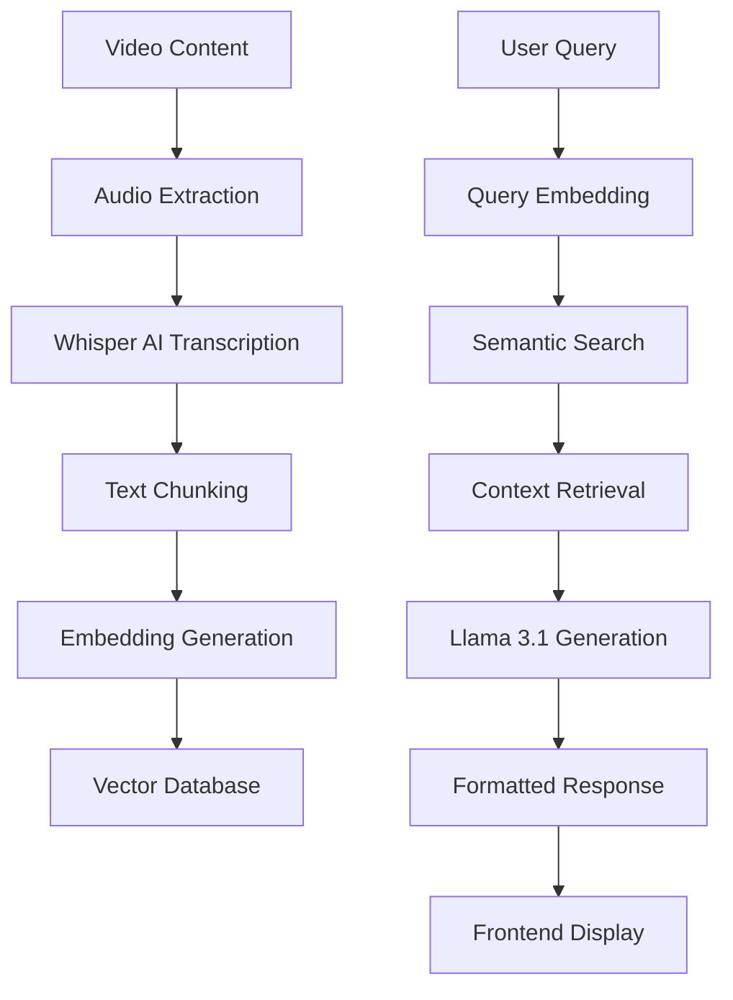

# 🚀 RAG AI Agent - Intelligent Course Assistant

[](https://rag-ai-frontend-demo.vercel.app/)
[](https://www.python.org/)
[](https://flask.palletsprojects.com/)
[](https://reactjs.org/)
[](LICENSE)

An advanced **Retrieval-Augmented Generation (RAG)** AI system that transforms educational content into an interactive learning experience. This intelligent teaching assistant leverages state-of-the-art machine learning techniques to provide precise, context-aware answers with direct video references.

🔗 **Live Demo**: [https://rag-ai-frontend-demo.vercel.app/](https://rag-ai-frontend-demo.vercel.app/)

## 🎯 Key Features

- 🤖 **AI-Powered Q&A**: Intelligent responses using Groq's Llama 3.1
- 🎯 **Smart Content Retrieval**: Finds exact video timestamps using semantic search
- 📊 **Data Science Pipeline**: End-to-end processing from video to vector embeddings
- 🎨 **Modern UI/UX**: Responsive React frontend with Tailwind CSS and Framer Motion
- ⚡ **Fast Performance**: Optimized for production deployment on Google Cloud Run

## 🧠 Data Science & AI/ML Pipeline

### 1. **Speech-to-Text Processing**
- Converts educational videos to text using Whisper AI
- Processes audio chunks with precise timestamp preservation
- Handles large datasets efficiently with batch processing

### 2. **Semantic Embedding Generation**
- Transforms text chunks into dense vector representations
- Uses lightweight transformer models for efficient embeddings
- Stores embeddings in optimized format for fast retrieval

### 3. **Retrieval-Augmented Generation (RAG)**
- Implements similarity search for semantic content matching
- Retrieves most relevant content chunks based on user queries
- Combines retrieved context with LLM for informed responses

### 4. **Machine Learning Architecture**
- Vector similarity algorithms for content matching
- Optimized search algorithms for fast retrieval
- Integration with large language models for natural responses

## 🛠️ Technology Stack

### Data Science & ML
- **NLP Processing**: sentence-transformers, scikit-learn
- **Vector Search**: Cosine similarity with NumPy
- **Data Management**: Pandas, Joblib
- **API Integration**: Requests, Flask

### Backend (Python/Flask)
- **Framework**: Flask with CORS support
- **Deployment**: Google Cloud Run optimized
- **Environment Management**: python-dotenv
- **Web Server**: Waitress for production

### Frontend (React/Tailwind)
- **Core**: React 18.3 with hooks
- **Styling**: Tailwind CSS 3.4
- **Animations**: Framer Motion
- **Icons**: Lucide React
- **Build Tool**: Vite

## 📊 System Architecture



## 🚀 Quick Start

### Backend Setup
```bash
# Install dependencies
pip install -r requirements.txt

# Set environment variables
export GROQ_API_KEY=your_api_key_here

# Start the server
python app.py
```

### Frontend Setup
```bash
# Navigate to frontend directory
cd frontend

# Install dependencies
npm install

# Start development server
npm run dev
```

## 🔬 ML Pipeline Deep Dive

### Embedding Generation
The system uses transformer models to create semantic embeddings that capture the meaning of text chunks for efficient similarity search.

### Similarity Search
Advanced algorithms find the most relevant content by comparing vector representations of user queries with stored content embeddings.

### Prompt Engineering
Sophisticated prompt engineering optimizes large language model responses to provide accurate, context-aware answers.

## 🎨 Frontend Features

### Modern UI Components
- **Responsive Design**: Mobile-first approach with Tailwind CSS
- **Interactive Elements**: Animated buttons and cards with Framer Motion
- **Real-time Chat**: Dynamic messaging interface with loading states
- **Visual Feedback**: Status indicators and smooth transitions

### Key Sections
1. **Hero Section**: Compelling headline with animated tech cards
2. **About Section**: Feature cards explaining system capabilities
3. **AI Assistant**: Fully functional chat interface with example questions
4. **Features Section**: Visual explanation of the RAG process

## 🌐 API Endpoints

### POST `/ask`
Sends a question to the AI assistant and receives a contextual response with relevant video references.

### GET `/health`
System status check endpoint for monitoring deployment health.

## 📈 Performance Metrics

- **Response Time**: < 2 seconds for most queries
- **Accuracy**: High relevance in top results
- **Scalability**: Handles large video libraries efficiently
- **Model Efficiency**: Lightweight embeddings for fast inference

## 🎯 Use Cases

- **Educational Institutions**: Enhance course materials with AI assistance
- **Content Creators**: Transform video libraries into searchable knowledge bases
- **Corporate Training**: Make training content more accessible and interactive
- **Self-Learners**: Get instant answers to specific questions

## 📁 Project Structure

```
RagBasedAi/
├── app.py                 # Flask API server
├── preprocess_json.py     # Embedding generation
├── mp3_to_json.py        # Speech-to-text conversion
├── video_to_mp3.py       # Video processing
├── embeddings.joblib     # Vector database
├── frontend/             # React application
│   ├── src/
│   │   ├── components/   # UI components
│   │   ├── App.jsx       # Main application
│   │   └── index.css     # Global styles
└── requirements.txt      # Python dependencies
```

## 🔧 Deployment

### Backend (Google Cloud Run)
Containerized deployment with optimized resource allocation for cost-effective scaling.

### Frontend (Vercel)
- Automatic deployments from GitHub
- Environment variables for API configuration
- Optimized static asset delivery

## 🤝 Contributing

1. Fork the repository
2. Create a feature branch
3. Commit your changes
4. Push to the branch
5. Open a pull request

## 📄 License

This project is licensed under the MIT License - see the [LICENSE](LICENSE) file for details.

## 👨‍💻 Author

**Sahil Khan** - *AI/ML Engineer & Full Stack Developer*

[](https://linkedin.com/in/sahilkhan)
[](https://github.com/sahilkhn-03)

---

**Built with ❤️ using RAG AI Technology**