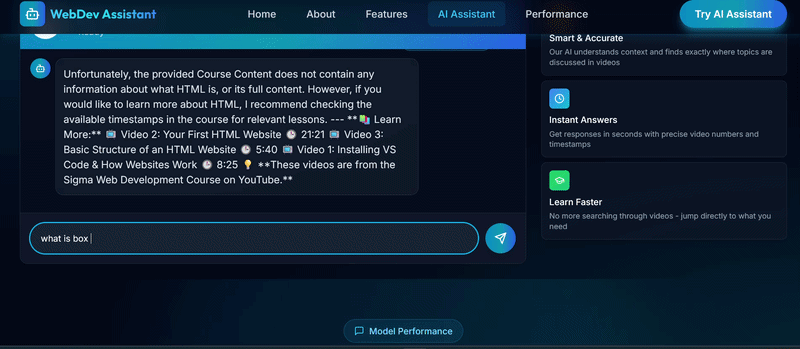

🚀 RAG AI Agent

<p align="center">
  
</p><p align="center">
  Retrieval-Augmented Generation (RAG) system for querying educational video content with context-aware answers and timestamp references.
</p>✨ Features

- 🤖 Natural language question answering
- 🔍 Semantic search over video transcripts
- ⏱️ Timestamp-based content retrieval
- 🎤 Whisper transcription pipeline
- 🌐 Responsive web interface

🛠️ Tech Stack

AI / ML

- Whisper
- Sentence Transformers
- Scikit-learn

Backend

- Python
- Flask

Frontend

- React
- Tailwind CSS
- Framer Motion

Deployment

- Google Cloud Run
- Vercel

## 🏗️ Architecture

```text
┌─────────────┐
│ Video Input │
└──────┬──────┘
       ↓
┌─────────────┐
│ Whisper STT │
└──────┬──────┘
       ↓
┌─────────────┐
│ Embeddings  │
└──────┬──────┘
       ↓
┌─────────────┐
│ Vector DB   │
└──────┬──────┘
       ↓
┌─────────────┐
│ Retrieval   │
└──────┬──────┘
       ↓
┌─────────────┐
│ Llama 3.1   │
└──────┬──────┘
       ↓
┌─────────────┐
│ Response +  │
│ Timestamp   │
└─────────────┘

👨‍💻 Author

Sahil

🔗 LinkedIn: https://www.linkedin.com/in/sahil-%E3%85%A4-3552b3290/

💻 GitHub: https://github.com/sahilkhn-03
